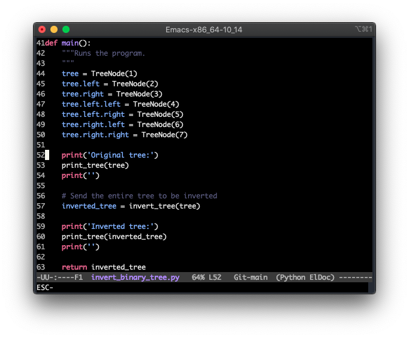
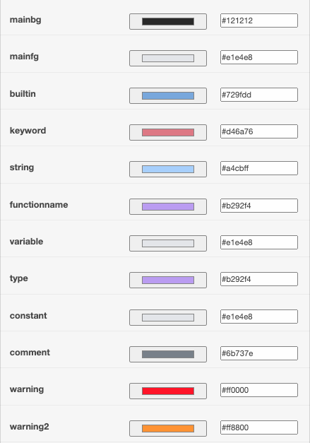

<div align="center">

# GitHub Dark Visual Studio Code Emacs Theme

The [GitHub Dark Theme](https://marketplace.visualstudio.com/items?itemName=GitHub.github-vscode-theme) from Visual Studio Code ported to Emacs.

[](https://github.com/Justintime50/github-dark-vscode-emacs-theme/actions)
[](LICENSE)



## Color Palette



</div>

## Install

**Automated**

```bash
bash <(curl -s https://raw.githubusercontent.com/justintime50/github-dark-vscode-emacs-theme/main/install.sh)
```

**Manually**

Add the `github-dark-vscode-theme.el` file to `~/.emacs.d/themes`.

**Enabling Theme**

Add the following to your `init.el` or `~/.emacs` file:

```lisp
(add-to-list 'custom-theme-load-path "~/.emacs.d/themes")
(load-theme 'github-dark-vscode t)
```
